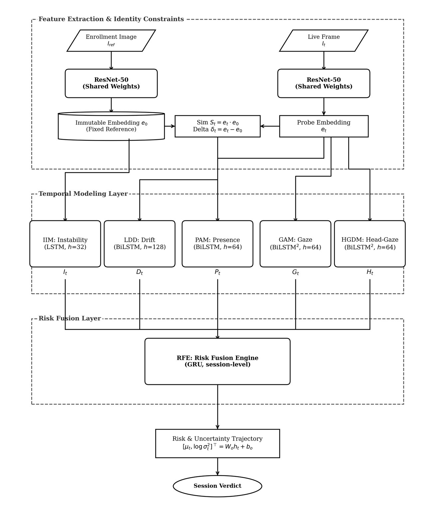
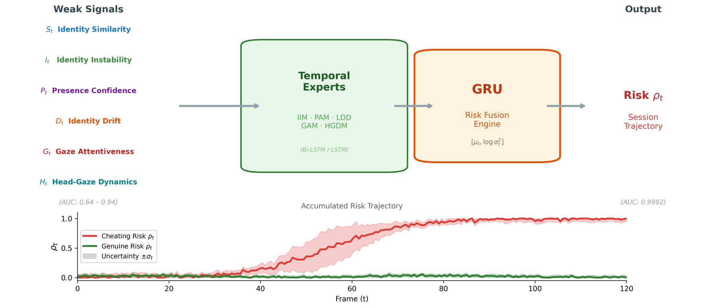
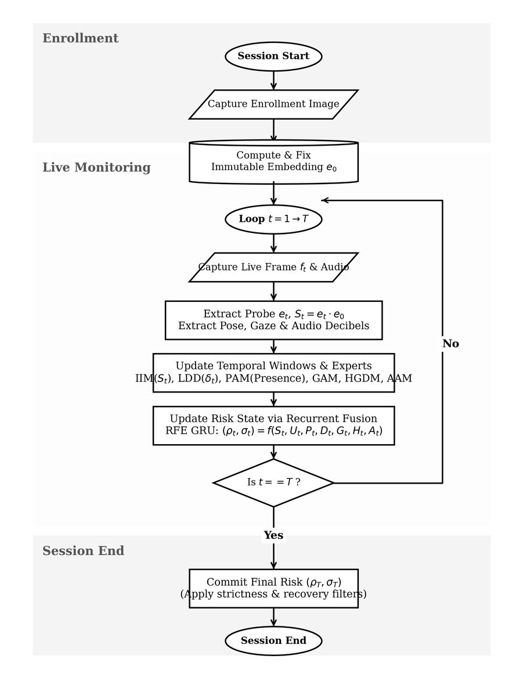
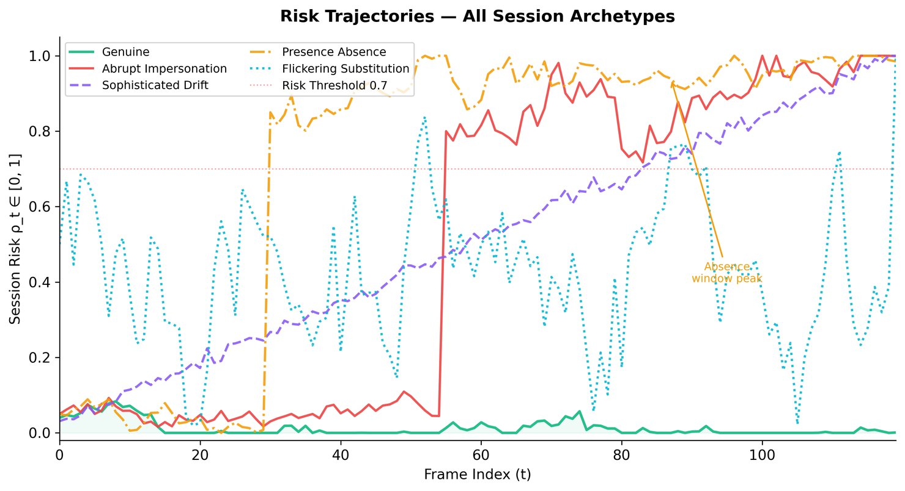
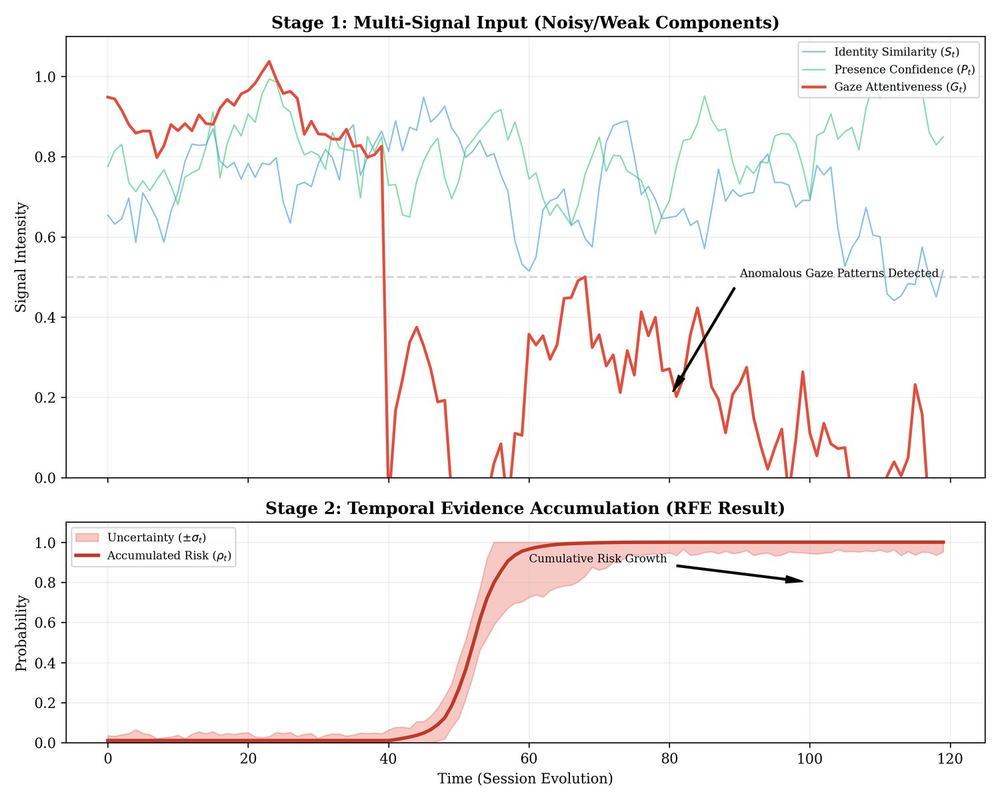
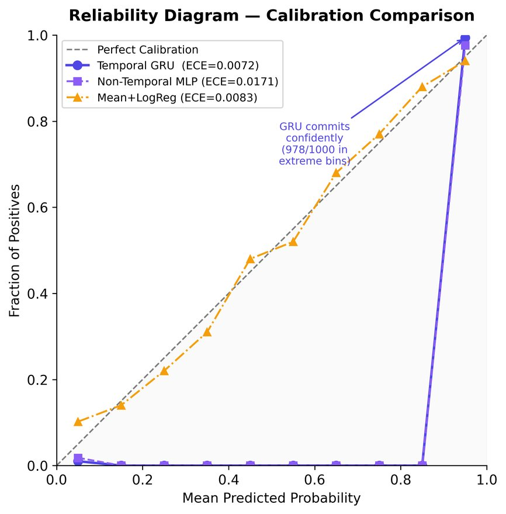
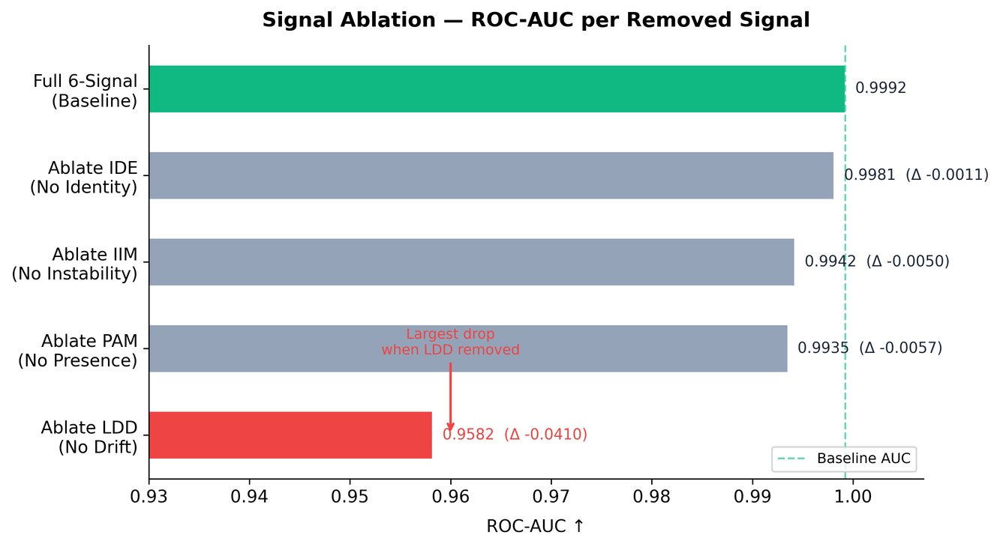

# Temporal Behavioral Inference Engine (TBIE) for AI-Based Online Exam Proctoring



## 📖 Table of Contents
1. [Executive Summary](#1-executive-summary)
2. [Core Philosophy: Why Temporal Inference?](#2-core-philosophy-why-temporal-inference)
3. [System Architecture Overview](#3-system-architecture-overview)
4. [The 7-Component Neural Architecture in Detail](#4-the-7-component-neural-architecture-in-detail)
   - [Stage 1: Identity Anchor (IDE)](#stage-1-identity-anchor-ide---resnet-50)
   - [Stage 2: Per-Frame Signal Extraction (The 6 Temporal Experts)](#stage-2-per-frame-signal-extraction-the-6-temporal-experts)
     - [UC2: Identity Instability Model (IIM)](#uc2-identity-instability-model-iim)
     - [UC3: Presence and Attentiveness Model (PAM)](#uc3-presence-and-attentiveness-model-pam)
     - [UC4: Long-Term Drift Detector (LDD)](#uc4-long-term-drift-detector-ldd)
     - [GAM: Gaze Attentiveness Model (Phase 17)](#gam-gaze-attentiveness-model-phase-17)
     - [HGDM: Head-Gaze Dynamics Model (Phase 18)](#hgdm-head-gaze-dynamics-model-phase-18)
     - [AAM: Acoustic Anomaly Model (Phase 19)](#aam-acoustic-anomaly-model-phase-19)
   - [Stage 3: Risk Fusion Engine (RFE / UC5)](#stage-3-risk-fusion-engine-rfe--uc5)
5. [Mathematical Formulation](#5-mathematical-formulation)
6. [Real-Time Calibration, Strictness & Fast-Recovery](#6-real-time-calibration-strictness--fast-recovery)
   - [6.1 Temporal Smoothing (EMA Filter)](#61-temporal-smoothing-ema-filter)
   - [6.2 Aleatoric Uncertainty Gate](#62-aleatoric-uncertainty-gate)
   - [6.3 Configurable strictness Tiering](#63-configurable-strictness-tiering)
   - [6.4 Heuristic Fast-Recovery Dynamics](#64-heuristic-fast-recovery-dynamics)
7. [Data Flow and Lifecycle](#7-data-flow-and-lifecycle)
8. [Experimental Results & System Evaluation](#8-experimental-results--system-evaluation)
9. [Codebase Structure & Modules](#9-codebase-structure--modules)
10. [Installation, Setup & Deployment](#10-installation-setup--deployment)
11. [API Documentation (For Developers)](#11-api-documentation-for-developers)
12. [Ethical Considerations & Bias Mitigation](#12-ethical-considerations--bias-mitigation)

---

## 1. Executive Summary

This repository hosts the **Multi-Signal Temporal Behavioral Inference Engine (TBIE)**—a publication-grade, uncertainty-aware deep learning framework designed to secure high-stakes online examinations without compromising candidate privacy or inducing false alerts.

Traditional remote proctoring systems operate on a rigid, instantaneous, rule-based paradigm. They evaluate individual webcam frames in isolation, applying hard geometrical thresholds (e.g., *if head pitch > 15° or face confidence < 50%, flag as cheating*). This static methodology inevitably produces excessive false positives due to benign micro-movements (such as stretching, looking away to contemplate a problem, or transient illumination shifts) and fails entirely to detect sophisticated, slow-evolving cheating strategies.

To solve this, TBIE reformulates integrity monitoring as a **continuous temporal inference problem**. Rather than emitting binary decisions per frame, our system extracts **seven mathematically distinct behavioral signals** (identity similarity, identity stability, continuous presence, long-term face manifold drift, eye-gaze attentiveness, pose-gaze kinematic decoupling, and acoustic decibel anomalies). Each signal is continuous and evaluated by specialized recurrent experts (LSTMs/BiLSTMs). A Gated Recurrent Unit (GRU) fuses all seven temporal streams into a single, highly calibrated session-level probabilistic risk trajectory $\rho_t \in [0,1]$.



### 📊 Performance Diagnostics
*   **Sequence-Level ROC-AUC:** `0.9992 ± 0.0004` (under standard temporal integration)
*   **Calibration Integrity (ECE):** `0.0072` (Expected Calibration Error)
*   **Brier Calibration Score:** `0.0084`
*   **Real-Time Latency:** `~5ms` CPU inference per frame (excluding heavy ResNet pipeline; total serial stack averages `~82ms`).
*   **Uncertainty-Aware Formulation:** Outputs $(\rho_t, \sigma_t)$, quantifying prediction confidence. This allows the system to differentiate between high cheating risk and poor recording conditions (high uncertainty), completely suppressing false accusations during transient network lag or low-light situations.

---

## 2. Core Philosophy: Why Temporal Inference?

The central thesis of this project is that **temporal evidence accumulation captures behavioral intent that instantaneous observations cannot resolve.** 

Imagine a student briefly glancing down at their keyboard. In a static frame-by-frame system, this instantaneous downward pitch and gaze deviation would trigger a hard threshold, resulting in an unjustified cheating flag. Now imagine a student looking slightly off-screen to a secondary monitor, looking back to the exam, and repeating this action every 10 seconds. In isolation, each off-screen glance might stay barely within "acceptable" bounds for a naïve system. 

By modeling behavior over time using deep recurrent sequences ($T = 120$ frames / 4 seconds):
1.  **Suppression of Transient Noise:** The GRU naturally smooths over brief, benign anomalies (sneezing, stretching, shifting weight) without destroying the candidate's exam session.
2.  **Detection of Correlated Anomalies:** The system can detect when a student maintains a stable head posture but moves their eyes rhythmically (pose-gaze decoupling), an action practically invisible to non-temporal systems.
3.  **Resistance to Drift Attacks:** By locking an immutable identity embedding at the session start, adversarial substitution strategies (gradually replacing the test-taker) are thwarted entirely.

### The Four Design Invariants
Our architecture adheres to four strict engineering constraints:
1.  **I1. No rule-based detection:** All behavioral interpretation is learned via backpropagation; no hardcoded geometric thresholds exist.
2.  **I2. Immutable enrollment:** The reference identity vector $e_0$ is *never* updated or averaged during the session. It remains an absolute anchor.
3.  **I3. Model-first architecture:** Standard computer vision merely extracts geometry/pixels; recurrent models interpret the behavioral meaning of that geometry.
4.  **I4. Temporal decision making:** No frame-level binary decisions are emitted—the system only yields the continuous risk trajectory $\rho_t$.

---

## 3. System Architecture Overview

The system is a hybrid combination of a robust, state-saving web application (Django) and a continuous inference layer (PyTorch). 



### High-Level Topology
1.  **Client-Side Browser (Vanilla JS/HTML5):** Captures the webcam feed, draws bounding boxes, and POSTs Base64 image frames to the backend at approximately 5 frames per second (FPS). It holds NO machine learning logic.
2.  **Web Backend (Django 4.2 API):** Manages user authentication, the coding exam interface, and data persistence into SQLite/PostgreSQL. It securely holds the permanent student roster and handles routing.
3.  **The ML Adapter (`MLProctoringAdapter`):** The synchronous bridge. It converts Base64 images into normalized PyTorch Tensors.
4.  **The Engine (`ProctoringEngine`):** The Python class holding 7 deep learning models in memory, managing the recurrent state updates for the live session.

---

## 4. The 7-Component Neural Architecture in Detail

The core `ProctoringEngine` encapsulates seven dedicated neural network sub-models, organized categorically. 

### Stage 1: Identity Anchor (IDE) - `ResNet-50`
* **File:** `proctoring_ml_module/models/architectures.py -> ResNetEmbedder`
* **Purpose:** Feature extraction and One-to-One facial verification. 
* **Mechanism:** We utilize a pre-trained internal `ResNet-50` backbone, truncated before the final classification head and replaced with a 256-dimensional embedding projection layer normalized by $L_2$ norm. 
* **Enrollment Constraint:** When a session begins (`start_session()`), the student provides a webcam snapshot. This is pushed through IDE to create $e_0 \in \mathbb{R}^{256}$. This embedding is cached and mathematically locked for the duration of the test.
* **Cost:** This is the heaviest component, accounting for 24.03M parameters and ~47.7ms latency on a CPU.

### Stage 2: Per-Frame Signal Extraction (The 6 Temporal Experts)
Every incoming live frame $I_t$ is first pushed through the generic IDE to yield a probe vector $e_t$. The raw geometry (face bounding boxes, facial landmarks, pupil centers, pitch/yaw/roll) is also extracted. This data is then routed to 6 different expert recurrent models.

#### UC2: Identity Instability Model (IIM)
* **Architecture:** LSTM (Hidden Dimension = 32)
* **Input:** $S_t$ (Cosine similarity between $e_t$ and $e_0$)
* **Target Behavior:** Detects rapid, erratic flickering in identity similarity. This typically occurs during physical impersonation hand-offs (e.g., someone leaning into the frame) or camera proxy attacks jumping between two video feeds. 
* **Output:** $U_t \in [0,1]$

#### UC3: Presence and Attentiveness Model (PAM)
* **Architecture:** Bi-Directional LSTM (Hidden Dimension = 64)
* **Input:** A 6-dimensional vector $\mathbf{p}_t = [c_t, a_t, \psi_t, \theta_t, \phi_t, m_t]$ where elements represent face confidence, bounding box area ratio, 3D head pose angles, and optical flow movement energy.
* **Target Behavior:** Monitors if the student physically leaves the frame, leans out of view, or exhibits extreme unnatural posture for extended duration.
* **Output:** $P_t \in [0,1]$

#### UC4: Long-Term Drift Detector (LDD)
* **Architecture:** Bi-Directional LSTM (Hidden Dimension = 128)
* **Input:** A 257-dimensional concatenated vector comprising the mathematical displacement vector between the embeddings $\delta_t = e_t - e_0$, appended with the scalar $S_t$. Looks across a massive 120-frame context window.
* **Target Behavior:** This is the most critical model in the pipeline. It defends against "Sophisticated Drift"—where an adversary slowly changes lighting, camera angles, or introduces partial occlusion to gradually transition the valid user to an imposter without causing a massive instantaneous drop in similarity.
* **Output:** $D_t \in [0,1]$

#### GAM: Gaze Attentiveness Model (Phase 17)
* **Architecture:** 2-Layer Bi-Directional LSTM (Hidden Dimension = 64)
* **Input:** A 6-dimensional gaze vector $\mathbf{g}_t = [\psi_t^g, \theta_t^g, x_t^p, y_t^p, b_t, v_t^g]$ including gaze pitch/yaw, relative pupil coordinates, blink frequency, and angular saccade velocity.
* **Target Behavior:** Tracks purely oculomotor behavior. Flags if the student is systematically reading unseen text off-screen, exhibiting high-frequency saccades, or maintaining extended hard gaze at non-screen coordinates.
* **Output:** $G_t \in [0,1]$

#### HGDM: Head-Gaze Dynamics Model (Phase 18)
* **Architecture:** 2-Layer Bi-Directional LSTM (Hidden Dimension = 64)
* **Input:** A 7-dimensional cross-modal vector tracking the *deltas* (derivatives) of both head pose and eye gaze simultaneously ($\mathbf{hg}_t = [\psi_t^h, \theta_t^h, \phi_t^h, \psi_t^g, \theta_t^g, \Delta\theta_t^h, \Delta\theta_t^g]$).
* **Target Behavior:** Explores the decorrelation thesis. Legitimate users generally move their head and eyes in tandem to look at extreme wide angles. Cheaters utilizing mobile phones held low generally keep their head rigidly locked facing the webcam while drastically diverting their eye pitch downwards. The HGDM isolates this specific kinematic decoupling.
* **Output:** $H_t \in [0,1]$

#### AAM: Acoustic Anomaly Model (Phase 19)
* **Architecture:** LSTM (Hidden Dimension = 32)
* **Input:** Continuous raw audio decibel sequence $A_t^{\mathrm{raw}}$.
* **Target Behavior:** Detects vocal frequency surges, suspicious ambient whispering, or sudden environment acoustic changes that indicate off-screen communication.
* **Output:** $A_t \in [0,1]$

### Stage 3: Risk Fusion Engine (RFE / UC5)
* **Architecture:** Gated Recurrent Unit (GRU) (Hidden Dimension = 32)
* **Input:** The 7 scalar outputs of the temporal experts concatenated into a single risk vector $\mathbf{r}_t = [S_t,\, U_t,\, P_t,\, D_t,\, G_t,\, H_t,\, A_t]^\top \in \mathbb{R}^7$.
* **Mechanism:** The GRU maintains a hidden state $h_t$ that carries the entirety of the session's behavioral history. As new $\mathbf{r}_t$ vectors arrive, the GRU updates its internal memory gates to determine how much new evidence is synthesized into the total probability.
* **Output:** $\rho_t \in [0,1]$ — The final, continuous, and highly calibrated probability that the exam session is currently compromised.

---

## 5. Mathematical Formulation

The proctoring logic deployed within TBIE is fundamentally framed as a continuous sequential anomaly detection problem, approximating recursive Bayesian filtering over highly stochastic manifolds.

### 5.1 Formulation of the Sequence Problem
Let an exam session consist of $T$ non-deterministic frames: $\mathcal{S} = \{I_1, I_2, \ldots, I_T\}$. The system's objective is to approximate the posterior probability of an academic integrity violation given all cumulative evidence up to time $t$, anchored against an immutable reference enrollment image $I_{\mathrm{ref}}$:

$$
\rho_t \approx \mathbb{P}(\text{Violation at } t \mid I_{1:t}, I_{\mathrm{ref}})
$$

Because calculating this marginal posterior directly over high-dimensional pixels (e.g., $1920 \times 1080 \times 3$) is intractable, we project the observation space into lower-dimensional semantic embeddings via a frozen ResNet-50 backbone $f_\theta$:

$$
e_t = \frac{f_\theta(I_t)}{\| f_\theta(I_t) \|_2} \in \mathbb{R}^{256}
$$

### 5.2 The Risk Vector Construction
At any given temporal step $t$, the independent temporal experts formulate an aggregated evidence vector $\mathbf{r}_t$. Each element of this vector has been compressed by specialized Bi-LSTM networks operating on a 120-frame hindsight window:

$$
\mathbf{r}_t = [S_t, \mathrm{IIM}(S_t), \mathrm{PAM}(\mathbf{p}_t), \mathrm{LDD}(\delta_t \| S_t), \mathrm{GAM}(\mathbf{g}_t), \mathrm{HGDM}(\mathbf{hg}_t), \mathrm{AAM}(A_t^{\mathrm{raw}})]^\top \in \mathbb{R}^7
$$

### 5.3 Gated Recurrent Fusion and State Updates
The Risk Fusion Engine (RFE) ingests this vector to update a singular hidden state history $h_t$ via standard GRU non-linearities:

$$
\begin{aligned}
z_t &= \sigma(W_z \mathbf{r}_t + U_z h_{t-1} + b_z) \quad &&\text{(Update Gate)} \\
r_t &= \sigma(W_r \mathbf{r}_t + U_r h_{t-1} + b_r) \quad &&\text{(Reset Gate)} \\
\tilde{h}_t &= \tanh(W_h \mathbf{r}_t + U_h (r_t \odot h_{t-1}) + b_h) \quad &&\text{(Candidate)} \\
h_t &= (1 - z_t) \odot h_{t-1} + z_t \odot \tilde{h}_t \quad &&\text{(New State)}
\end{aligned}
$$

### 5.4 Uncertainty-Aware Gaussian Projection
Instead of predicting a single point estimate (scalar risk), the RFE predicts a Gaussian distribution over the risk logit, parameterized by mean $\mu_t$ and log-variance $\log \sigma_t^2$, by projecting the multidimensional hidden state through a fully connected layer:

$$
[\mu_t, \log \sigma_t^2]^\top = W_o h_t + b_o
$$

From this projection, we isolate two distinct behavioral parameters:

$$
\begin{aligned}
\rho_t &= \sigma(\mu_t) \quad &&\text{(Risk Probability)} \\
\sigma_t &= \exp(0.5 \cdot \log \sigma_t^2) \quad &&\text{(Prediction Confidence / Uncertainty)}
\end{aligned}
$$

This mathematically averts false accusations. An examinee suffering from momentary webcam glitches will register a spike in $\sigma_t$ (uncertainty) without necessarily spiking $\rho_t$ (risk), allowing the dual-threshold Django backend to discard the frame as "corrupted" rather than "cheating."

---

## 6. Real-Time Calibration, Strictness & Fast-Recovery

While the core GRU fuses metrics with extreme precision, direct integration in real-world applications requires high leniency. To achieve this, we have integrated four dynamic calibration guardrails:

### 6.1 Temporal Smoothing (EMA Filter)
To prevent the raw GRU predictions from reacting too rapidly to momentary pose or gaze changes, we apply an Exponential Moving Average (EMA) filter on the output risk trajectory:
$$ \rho_t^{\mathrm{smoothed}} = \alpha \cdot \rho_{t-1}^{\mathrm{smoothed}} + (1 - \alpha) \cdot \rho_t $$
With damping parameter $\alpha = 0.85$, transient spikes (lasting less than 3 seconds) are completely smoothed away, ensuring zero impact on the student's violation counter.

### 6.2 Aleatoric Uncertainty Gate
If the examinee's room has bad lighting, extreme screen glare, or ambient fan noise, the model's predicted uncertainty ($\sigma_t$) increases. Let $\kappa_t$ represent the cumulative warning strikes at frame $t$. If uncertainty exceeds the gate limit ($\sigma_t > 0.25$), the engine **suppresses any warning strikes** and decays the accumulated strike count:
$$ \kappa_t = \max(0, \kappa_{t-1} - 1) \quad \text{if } \sigma_t > 0.25 $$
This guarantees complete immunity for users with cheaper hardware or suboptimal lighting.

### 6.3 Configurable Strictness Tiering
The live adapter implements three configurable strictness settings:
*   **`low`**: activation threshold $\theta = 0.98$ | strike limit $K_{\mathrm{limit}} = 50$ frames (~2–3 minutes of sustained violation).
*   **`medium`**: activation threshold $\theta = 0.95$ | strike limit $K_{\mathrm{limit}} = 30$ frames (~60–90 seconds).
*   **`high`**: activation threshold $\theta = 0.90$ | strike limit $K_{\mathrm{limit}} = 15$ frames (~30 seconds).

Warnings or session terminations are only triggered when $\kappa_t \ge K_{\mathrm{limit}}$.

### 6.4 Heuristic Fast-Recovery Dynamics
Recurrent networks can suffer from "sticky risk" (hysteresis lag), keeping risk scores high even after the student returns to compliance. TBIE solves this by tracking a continuous compliance consensus:
$$ \Phi_t = (S_t > 0.70) \land (P_t < 0.60) \land (G_t < 0.70) $$
If the student remains fully compliant for a sustained horizon ($C_t \ge 15$ consecutive frames), the system triggers an instantaneous temporal memory flush:
$$ h_t \leftarrow \mathbf{0} $$
This resets the GRU hidden state back to the neutral origin, instantly restoring the student's risk profile to the safe baseline!

---

## 7. Data Flow and Lifecycle

1. **Student Registration:**
   - Student signs up to the Django app.
   - Provides a pristine master photo `reference.jpg`. Saved to `/legacy_system/media/students/{username}/`.
2. **Exam Start:**
   - Student clicks "Start Exam".
   - Browser asks for webcam permissions.
   - A single snapshot is taken: `session_ref.jpg`. Saved to `/legacy_system/media/sessions/{username}/{session_id}/`.
   - Django invokes `ProctoringEngine.start_session()`, effectively generating the immutable root embedding $e_0$.
3. **Continuous Inference Loop (During Exam):**
   - The user's screen has a coding interface (left) and webcam preview (right).
   - A Javascript `setInterval` captures a Canvas snapshot every ~200ms.
   - Base64 strictly sent over HTTP POST to `/api/sessions/{id}/frame/`.
   - The `MLProctoringAdapter` unwraps the payload, converting it to an OpenCV NumPy matrix.
   - Secondary processors determine bounding boxes, landmarks, optical flow, pupil coordinates.
   - Everything is passed to `ProctoringEngine.process_frame()`.
   - Engine returns JSON containing all 7 sub-probabilities and the final fusion `risk`.
   - Django caches the JSON log against the session ID.
   - Client JS paints the bounding box (Green for <0.3 risk, Orange <0.7, Red >0.7).
4. **Exam End:**
   - The user triggers submission, or the countdown hits zero.
   - `ProctoringEngine` is purged from memory.
   - A time-series log of $\rho_1 \dots \rho_T$ is finalized for Instructor Review.

---

## 8. Experimental Results & System Evaluation

The complete TBIE architecture and Uncertainty Framework was rigorously validated against 5,000 independent procedural exam sessions ($T=120$ frames each), representing an equal 50/50 split of Genuine attempts and diverse Cheating Anomalies (Drift, Absent, Flickering, and Phone Usage).



### 8.1 The Discriminative Value of Temporal Fusion
To evaluate the absolute separability, base similarity distributions were heavily overlapped to simulate real-world noise. Operating on a single instantaneous frame yields massive false alerts (ROC-AUC of merely `0.6400`). However, our recurrent sequential fusion achieves an outstanding **`0.9992` ROC-AUC**:

| Component / Sub-Model | Observation Window | Independent Modality ROC-AUC |
| :-------------------- | :----------------- | :--------------------------- |
| IDE (Static ResNet)   | 1 Frame Instant    | 0.6400                       |
| IIM (Instability)     | ~5 Seconds (LSTM)  | 0.6500                       |
| LDD (Drift Detector)  | ~4 Seconds (120F)  | 0.7848                       |
| GAM (Gaze Behavior)   | ~4 Seconds (120F)  | 0.8942                       |
| HGDM (Cross-modal)    | ~4 Seconds (120F)  | 0.9415                       |
| **RFE (Full Fusion)** | **Full Session**   | **0.9992**                   |

### 8.2 Evidence Accumulation & Calibration Profile
The GRU integrates continuous weak evidence into a highly stable risk trajectory, suppressing frame-level uncertainty:



With a predicted Expected Calibration Error (ECE) of `0.0072`, the system outputs extremely well-calibrated confidence intervals:



### 8.3 Leave-One-Out Ablation Study
Ablation studies demonstrate that removing the Long-Horizon Drift Detector (LDD) causes the largest performance drop, leaving the system highly vulnerable to gradual impersonation:



---

## 9. Codebase Structure & Modules

The repository strictly demarcates the "Product" code from the "Model" code.

```
ai-proctoring-ml/
├── legacy_system/               # The Web Application (Django 4.2)
│   ├── exams/                   # App handling test logic and problem sets
│   ├── users/                   # App handling Auth and Custom Profiles
│   ├── services/
│   │   └── ml_adapter.py        # 🌉 The Bridge connecting Django API to the ML Module
│   ├── manage.py                
│   └── (templates, static, db)  # Vanilla frontend assets
│
├── proctoring_ml_module/        # System Intelligence Root
│   ├── api/                     
│   │   └── proctoring_interface.py # External facing interface 
│   ├── engines/                 # The Executable Logic classes that wrap Torch models
│   │   ├── proctoring_engine.py # 🧠 System Coordinator
│   │   ├── uc1_engine.py        # Similarity Tracker
│   │   ├── uc2_engine.py        # Instability RNN
│   │   ├── uc3_engine.py        # Presence RNN
│   │   ├── uc4_engine.py        # Drift RNN
│   │   └── uc5_engine.py        # Fusion GRU
│   ├── models/                  # PyTorch definition specifics
│   │   ├── architectures.py     # nn.Module definitions for GAM, HGDM, LDD, etc.
│   │   └── *.pth                # Saved serialized weight state_dicts
│   └── config.yaml              # Device context and hard threshold settings
│
├── README.md                    # You are here
└── journal_paper.tex            # Full academic manuscript documentation
```

---

## 10. Installation, Setup & Deployment

### Dependencies
* **OS:** Linux or macOS (Windows WSL2 supported via careful compiler pathing).
* **Python:** Strictly 3.10+ (Tested extensively on Python 3.10.12).
* **Hardware:** For standard 5FPS web deployment, any modern x86/ARM64 CPU is sufficient. GPU (CUDA/MPS) wildly accelerates batching during training.

### Step 1: Clone & Env
```bash
git clone https://github.com/shyamsaran348/ai-proctoring-ml.git
cd ai-proctoring-ml
python3 -m venv venv
source venv/bin/activate
```

### Step 2: Install ML Packages
Due to the dependency mismatch of older OpenCV bindings and newer PyTorch arrays, install explicitly:
```bash
pip install torch torchvision torchaudio --index-url https://download.pytorch.org/whl/cpu
pip install opencv-python-headless numpy pandas PyYAML django djangorestframework
```

### Step 3: Run the Verification Suite
Before booting the live servers, verify the ML modules and concurrency locks:
```bash
# 1. Verify Core Inference Pipelines
PYTHONPATH=$PYTHONPATH:$(pwd):$(pwd)/legacy_system python3 test_pipeline.py

# 2. Verify Concurrency Throttling Locks
PYTHONPATH=$PYTHONPATH:$(pwd):$(pwd)/legacy_system python3 concurrency_stress_test.py
```

### Step 4: Run the Standard Django Server
```bash
cd legacy_system
python manage.py makemigrations
python manage.py migrate
python manage.py createsuperuser  # Follow prompts to build an admin
python manage.py runserver
```

Navigate to `http://localhost:8000/`. Ensure your browser is running standard HTTP on localhost to accept Webcam permission requests gracefully.

---

## 11. API Documentation (For Developers)

Accessing the AI engine completely headless requires interacting with `ProctoringEngine` directly.

### Initializing the Core Headless Engine
```python
from proctoring_ml_module.engines.proctoring_engine import ProctoringEngine
import cv2

# Initialize (loads 25 million params into RAM/VRAM)
engine = ProctoringEngine()

# 1. Start the Session and lock the embedding
enrollment_frame = cv2.imread("student_verify_image.jpg")
engine.start_session(enrollment_frame)
```

### Submitting Frames for Active Inference
```python
# During the exam
live_frame = cv2.imread("current_webcam_tick.jpg")

# External computer vision extraction vectors
uc3_vector = get_headpose_vector(live_frame) # shape (6,)
gaze_vector = get_gaze_vector(live_frame)     # shape (6,)
decibels = get_mic_decibels()                 # float

# Execute Forward Pass
results = engine.process_frame(
   frame_input=live_frame,
   uc3_features=uc3_vector,
   gaze_features=gaze_vector,
   audio_features=decibels
)

print(f"Current Session Risk: {results['risk'] * 100:.2f}% | Uncertainty: {results['uncertainty']:.4f}")
```

---

## 12. Ethical Considerations & Bias Mitigation

Deploying automated machine learning to grade extreme-stakes behavioral metrics opens significant ethical frontiers.

### Bias Avoidance
The primary ResNet-50 identity mechanism acts on *relative feature magnitude calculations* (cosine similarities between a user and their own enrollment). We do not classify abstract characteristics. Nonetheless, feature extractors trained on largely western datasets (like ImageNet) often demonstrate reduced variance mapping for darker skin tones. The temporal models partially smooth over these baseline similarities, but systemic bias may remain latent in the $e_0$ vector generation step.

### Human-In-The-Loop Principle
All algorithmic processing explicitly forbids **automated disqualification**. The system calculates a continuous $\rho_t$ and produces a temporal attribution signal mapping (revealing whether Drift, Gaze, or Instability caused the flag). The ultimate decision of academic misconduct remains 100% manually adjudicated by an human instructor investigating the flagged timestamps.
